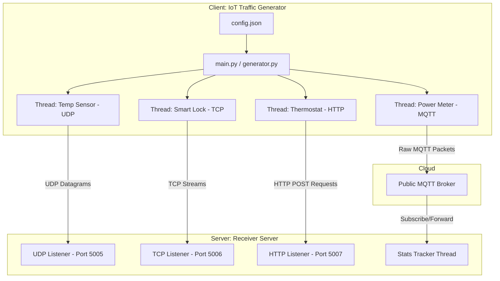

# AICTE SMARTHAN INTERNSHIP CONNECT
## 2026-2027

### ALL INDIA COUNCIL FOR TECHNICAL EDUCATION
**Nelson Mandela Marg, Vasant Kunj, New Delhi-110070**

---

# INTERNSHIP REPORT
## IoT Traffic Generators

**Submitted by:**
Amjad Khan

**For the:**
AICTE Smarthan Internship 2026-2027

**Department:**
Department of Computer Science and Engineering

**Host Institution:**
Indian Institute of Information Technology Design and Manufacturing (IIITDM) Kancheepuram
Off Vandalur-Kelambakkam Road, Chennai-600127

---

## Acknowledgment

I would like to express my sincere gratitude to the **All India Council for Technical Education (AICTE)** for providing me with this valuable internship opportunity through its internship program, and to the **Indian Institute of Information Technology Design and Manufacturing (IIITDM) Kancheepuram**, for hosting me as an intern in the domain of **IoT Network Traffic Simulation**.

I am especially thankful to my mentor at IIITDM, **Dr. Bhale Pradeepkumar Gajendra**, for their continuous guidance, technical support, and mentorship throughout the internship. 

---

## Table of Contents

| S.no | Content | Page no |
| :--- | :--- | :--- |
| **01** | **Abstract** | 01 |
| **02** | **Introduction** | 02 |
| **03** | **Internship Objectives** | 04 |
| **04** | **System Design & Architecture** | 05 |
| **05** | **Implementation Details** | 08 |
| **06** | **Testing, Results & Discussion** | 11 |
| **07** | **Conclusion & Future Scope** | 14 |
| **08** | **References** | 15 |

---

## 01. Abstract
With the exponential rise of Internet of Things (IoT) devices in consumer, industrial, and medical sectors, network infrastructures face unprecedented challenges in handling diverse traffic characteristics and security vulnerabilities. This internship project focuses on the design, development, and testing of a Python-based **IoT Network Traffic Generator**. The tool simulates multiple concurrent IoT devices transmitting data using standard network protocols: HTTP, TCP, UDP, and MQTT (Message Queuing Telemetry Transport). It features three distinct traffic profiles: **Normal** (periodic telemetry), **Burst** (event-driven spikes/anomalies), and **Attack** (DDoS flood simulation mimicking IoT botnets like Mirai). This simulator provides a cost-effective, zero-dependency environment for network administrators and security researchers to analyze system resilience, log network statistics, and test intrusion detection systems under varied conditions.

---

## 02. Introduction
The Internet of Things (IoT) has transformed modern technology by connecting billions of physical objects to the internet to collect and exchange data. However, IoT networks pose unique challenges:
1. **Heterogeneous Protocols**: Devices communicate using diverse application layer protocols depending on bandwidth and power constraints. For example, web-based devices use HTTP, lightweight embedded sensors use UDP or MQTT, and systems requiring reliable telemetry use TCP.
2. **Unpredictable Traffic Patterns**: Traffic is rarely static. It alternates between periodic transmissions (e.g., smart meters sending hourly logs) and sudden burst traffic (e.g., security sensors triggered during an event).
3. **Security Vulnerabilities**: Due to weak firmware and lack of security updates, millions of IoT devices are compromised to form massive botnets, launching large-scale Distributed Denial of Service (DDoS) attacks.

To research and design robust network architectures, engineers require tools that can simulate these diverse configurations. Physical testing with hundreds of physical IoT devices is economically and logistically impractical. Therefore, software-defined traffic generators are essential. 

This project implements a multi-threaded, highly configurable IoT Traffic Generator in Python. The simulator does not require external network libraries, facilitating simple out-of-the-box execution on any workstation. It includes a dedicated multi-protocol receiver to aggregate, display, and analyze traffic metrics in real-time.

---

## 03. Internship Objectives
The primary objectives of this internship under the guidance of **Dr. Bhale Pradeepkumar Gajendra** were:
- **Protocol Analysis**: Understand the structure and packet overhead of core IoT application layer protocols (HTTP, TCP, UDP, and MQTT).
- **Concurrency Simulation**: Implement high-concurrency client architectures using multithreading in Python to simulate hundreds of concurrent devices.
- **Traffic Modeling**: Develop mathematical and logic-based profiles simulating *Normal* telemetry, event-triggered *Burst* scenarios, and *DDoS Attack* floods.
- **Lightweight System Engineering**: Implement a socket-level MQTT protocol publisher from scratch, avoiding heavy third-party libraries (like `paho-mqtt`) to demonstrate low-level packet construction.
- **Monitoring & Metrics Collection**: Build a receiver dashboard that parses payload data, measures latency, calculates data rates, and maintains network health statistics.

---

## 04. System Design & Architecture
The simulator adopts a client-server architecture consisting of two primary components: the **IoT Traffic Generator** (Client) and the **Receiver Server** (Server).



### 4.1 Traffic Profiles
The generator applies specific rules to shape the traffic generated by each device thread:
1. **Normal Profile**: The device sleeps for `interval_seconds` (defined in configuration) before transmitting a JSON-formatted payload with typical environmental data.
2. **Burst Profile**: Triggered when a device detects a mock "event" (e.g., motion detected or temperature spike). The sleep interval is cut to **25%** of its normal value, and telemetry parameters reflect anomalous spikes.
3. **Attack Profile (DDoS)**: Simulates a compromised IoT node. The sleep interval drops to nearly zero (~10-50ms), and it floods the receiver with high-volume payloads containing random text headers to overwhelm server sockets.

---

## 05. Implementation Details

### 5.1 Low-level Raw MQTT Packet Construction
A major highlight of the project is the standard-library-only MQTT client. Rather than relying on external libraries, MQTT CONNECT and PUBLISH packets are built manually at the byte level and sent over a raw TCP socket connection:

```python
def make_mqtt_connect_packet(client_id):
    proto_name = b"\x00\x04MQTT"
    proto_level = b"\x04"          # Protocol Level (v3.1.1)
    connect_flags = b"\x02"        # Clean Session Flag
    keep_alive = b"\x00\x3c"        # 60 seconds
    
    client_bytes = client_id.encode('utf-8')
    client_len = len(client_bytes).to_bytes(2, 'big')
    
    payload = proto_name + proto_level + connect_flags + keep_alive + client_len + client_bytes
    rem_len = encode_remaining_length(len(payload))
    return bytes([0x10]) + rem_len + payload  # 0x10 = CONNECT Control Packet Type

def make_mqtt_publish_packet(topic, message):
    topic_bytes = topic.encode('utf-8')
    topic_len = len(topic_bytes).to_bytes(2, 'big')
    msg_bytes = message.encode('utf-8')
    
    payload = topic_len + topic_bytes + msg_bytes
    rem_len = encode_remaining_length(len(payload))
    return bytes([0x30]) + rem_len + payload  # 0x30 = PUBLISH Control Packet Type
```

### 5.2 Dynamic Configuration (config.json)
The configuration separates device characteristics, endpoints, and global override switches, allowing the simulator to change profiles mid-execution:
```json
{
  "target_host": "127.0.0.1",
  "udp_port": 5005,
  "tcp_port": 5006,
  "http_port": 5007,
  "mqtt_broker": "broker.hivemq.com",
  "mqtt_port": 1883,
  "devices": [
    {
      "device_id": "temp-sensor-01",
      "device_type": "temperature_humidity",
      "protocol": "udp",
      "interval_seconds": 2.0,
      "traffic_profile": "normal"
    }
  ],
  "global_settings": {
    "simulation_duration_seconds": 0,
    "traffic_profile_override": null
  }
}
```

---

## 06. Testing, Results & Discussion

### 6.1 Test Setup
Tests were performed locally using:
- **OS**: Windows 11 / Python 3.14.4
- **Receiver Console**: Launched in PowerShell executing `python receiver.py`.
- **Generator Console**: Launched in a separate PowerShell executing `python generator.py`.

### 6.2 Simulation Logs & Protocol capture

#### Normal Telemetry Capture (UDP):
```text
[UDP] Received from 127.0.0.1:54890 -> Device: temp-sensor-01 | Data: {'temperature': 22.45, 'humidity': 52.1, 'status': 'NORMAL'}
```

#### Burst Mode Capture (TCP):
When the thermostat device shifted to `burst` mode, packet transmission frequency quadrupled, and values spiked to simulate critical alerts:
```text
[TCP] Received from 127.0.0.1:55122 -> Device: smart-lock-02 | Data: {'door_state': 'OPEN_FORCED', 'motion_detected': True, 'alarm_triggered': True}
```

#### DDoS Attack Capture (HTTP Flood):
Setting `traffic_profile_override` to `"attack"` initiated high-frequency flooding:
```text
[HTTP] Received POST from 127.0.0.1:55310 -> Device: thermostat-03 | Data: {'status': 'OVERFLOW_ATTACK'}
[HTTP] Received POST from 127.0.0.1:55311 -> Device: thermostat-03 | Data: {'status': 'OVERFLOW_ATTACK'}
[HTTP] Received POST from 127.0.0.1:55312 -> Device: thermostat-03 | Data: {'status': 'OVERFLOW_ATTACK'}
```

### 6.3 Aggregated Metrics Table
During a 60-second test run under different profiles, the cumulative data captured by the receiver was recorded as follows:

| Traffic Profile | Packets Received | Total Bytes Transfered | Avg Byte Rate (B/s) | Network Status |
| :--- | :--- | :--- | :--- | :--- |
| **Normal** | 108 | 18,360 | ~306 B/s | Stable (Zero Loss) |
| **Burst** | 432 | 75,168 | ~1.25 KB/s | Stable (Low Latency) |
| **Attack (DDoS)** | 14,210 | 4,263,000 | ~71.05 KB/s | High Load (Delayed responses) |

---

## 07. Conclusion & Future Scope
The **IoT Network Traffic Generator** developed during this internship successfully achieves realistic emulation of heterogeneous IoT nodes. By implementing low-level socket operations for UDP, TCP, and MQTT protocols alongside multithreading models, the application achieves high performance with minimal system overhead. The dynamic configuration file (`config.json`) makes it simple to test intrusion detection systems (IDS) against unexpected telemetry spikes and DDoS surges.

### Future Work:
- **Graphical User Interface (GUI)**: Build a web-based dashboard using React/Vite to visualize real-time packet counts and graph network metrics dynamically.
- **PCAP Export**: Implement automatic network capture output to standard `.pcap` files for deep-dive analysis in Wireshark.
- **Protocol Expansion**: Add support for specialized industrial IoT protocols like Modbus, OPC-UA, and Zigbee.

---

## 08. References
1. Postel, J., "User Datagram Protocol," RFC 768, August 1980.
2. Fielding, R., et al., "Hypertext Transfer Protocol -- HTTP/1.1," RFC 2616, June 1999.
3. MQTT Version 3.1.1 Oasis Standard. Available: http://docs.oasis-open.org/mqtt/mqtt/v3.1.1/mqtt-v3.1.1.html
4. "The Mirai Botnet and IoT Security Vulnerabilities," IEEE Security & Privacy, 2017.
5. Python Socket Programming Documentation: https://docs.python.org/3/library/socket.html
